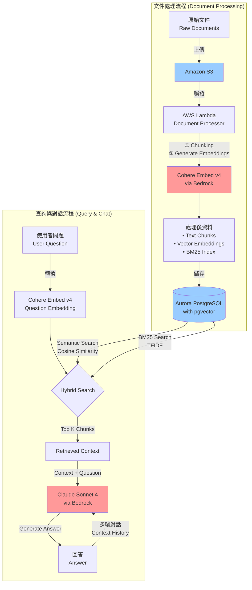
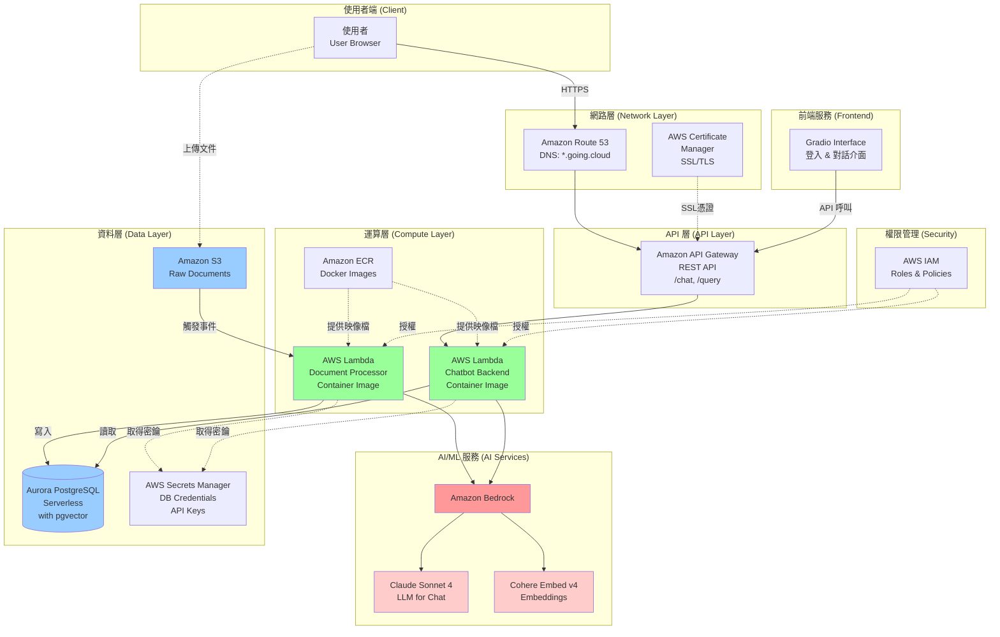
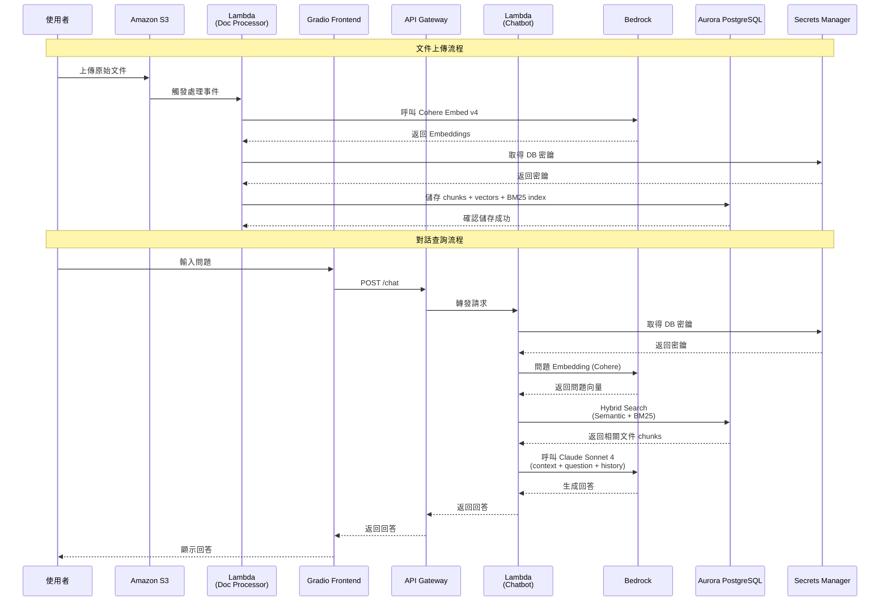

# HR Chatbot 系統架構圖

本文件包含 HR Chatbot 專案的完整系統架構圖，包括 RAG 流程、AWS 服務架構與資料流向。

## 1. RAG 核心流程架構

此圖展示文件處理與查詢對話的核心 RAG 流程。

### 流程說明

**文件處理流程**：

1. 使用者上傳原始文件至 Amazon S3
2. S3 事件觸發 AWS Lambda (Document Processor)
3. Lambda 執行文件處理：
   - Chunking：將文件切分成適當大小的片段
   - 呼叫 Cohere Embed v4 生成向量 Embeddings
   - 建立 BM25 索引所需資料
4. 將處理後的資料儲存至 Aurora PostgreSQL (含 pgvector 擴充)

**查詢與對話流程**：

1. 使用者提出問題
2. 使用 Cohere Embed v4 將問題轉換為向量
3. 執行 Hybrid Search：
   - Semantic Search：使用向量相似度 (Cosine Similarity)
   - BM25 Search：使用關鍵字搜尋 (基於 TFIDF)
4. 檢索 Top K 相關文件片段
5. 將檢索結果與問題一起傳給 Claude Sonnet 4
6. LLM 生成回答
7. 多輪對話時會將對話歷史納入 Context

---

## 2. AWS 整體服務架構

此圖展示所有 AWS 服務如何串接，包括前端、後端、資料庫與 AI 服務。

### 架構說明

**網路層**：

- Route 53 提供 DNS 解析 (\*.going.cloud)
- Certificate Manager 管理 SSL/TLS 憑證
- 所有流量透過 HTTPS 加密

**API 層**：

- API Gateway 提供 REST API 端點 (/chat, /query 等)
- 處理路由與請求轉發

**運算層**：

- 使用 Lambda Container Image 部署
- ECR 儲存 Docker 映像檔
- Lambda1: 文件處理器
- Lambda2: Chatbot 後端邏輯

**AI/ML 服務**：

- Amazon Bedrock 作為託管平台
- Claude Sonnet 4: 多輪對話 LLM
- Cohere Embed v4: 文件與問題 Embedding

**資料層**：

- S3: 儲存原始文件
- Aurora PostgreSQL Serverless: 主要資料庫 (含 pgvector)
- Secrets Manager: 管理資料庫密鑰與敏感資訊

**安全層**：

- IAM Roles 控制各服務間的存取權限

**前端**：

- Gradio 提供網頁介面
- 包含登入功能與對話介面

---

## 3. 詳細資料流向圖 (Sequence Diagram)

此圖展示完整的請求-回應流程，包括文件上傳與對話查詢。

### 流程說明

**文件上傳流程**：

1. 使用者上傳文件到 S3
2. S3 事件觸發 Lambda Document Processor
3. Lambda 呼叫 Bedrock 的 Cohere Embed v4 生成 embeddings
4. 從 Secrets Manager 取得資料庫密鑰
5. 將處理後的資料 (chunks, vectors, BM25 index) 寫入 Aurora PostgreSQL

**對話查詢流程**：

1. 使用者在 Gradio 前端輸入問題
2. 前端透過 API Gateway 呼叫 /chat 端點
3. API Gateway 轉發至 Lambda Chatbot
4. Lambda 從 Secrets Manager 取得 DB 密鑰
5. 將問題轉換為向量 (使用 Cohere Embed v4)
6. 在資料庫中執行 Hybrid Search (Semantic + BM25)
7. 將檢索到的相關文件、問題與對話歷史傳給 Claude Sonnet 4
8. LLM 生成回答
9. 回答沿著相同路徑返回給使用者

---

## 關鍵技術要點

### Hybrid Search 實作

**組合策略**：

- 🔍 **Semantic Search** (50%):
  - 使用 Cohere Embed v4 生成的向量
  - 透過 pgvector 計算 Cosine Similarity
  - 找出語義相關的文件

- 🔍 **BM25 Search** (50%):
  - 基於 TFIDF 的傳統資訊檢索
  - 找出關鍵字匹配的文件

- 📊 **混合範例**: 取前 10 個 chunks
  - 5 個來自 Semantic Search
  - 5 個來自 BM25 Search
  - 比例可調整作為 hyperparameter

### Hyperparameters 調整

需要透過實驗調整的參數：

- **Chunk Size**: 每個文件片段的大小
- **Overlap Size**: 片段間的重疊大小
- **Top K**: 檢索的文件數量
- **Search Ratio**: Semantic vs BM25 的比例

### 多輪對話 Context 管理

**挑戰**：

- 維護完整對話歷史
- 避免 context 過長導致 token 超限
- 平衡歷史資訊與新檢索內容的比重

**解決方案**：

- 設計良好的 System Prompt
- 實作 context window 管理策略
- 可能需要實作 conversation summarization

---

## AWS vs GCP 服務對照

| 功能            | GCP                 | AWS (本專案)                 |
| --------------- | ------------------- | ---------------------------- |
| 關聯式資料庫    | Cloud SQL           | Aurora PostgreSQL Serverless |
| 物件儲存        | Cloud Storage       | S3                           |
| Serverless 運算 | Cloud Functions     | Lambda                       |
| 容器註冊表      | Artifact Registry   | ECR                          |
| API 管理        | API Gateway         | API Gateway                  |
| 密鑰管理        | Secret Manager      | Secrets Manager              |
| DNS             | Cloud DNS           | Route 53                     |
| 憑證管理        | Certificate Manager | Certificate Manager          |
| AI/ML 平台      | Vertex AI           | Bedrock                      |

---

## 參考資源

- [專案 README](./README.md)
- [Google Drive 專案資料夾](https://drive.google.com/drive/u/1/folders/1KHnvLLubLUTg5nwfR3dZKgfWanQXw7UQ)
