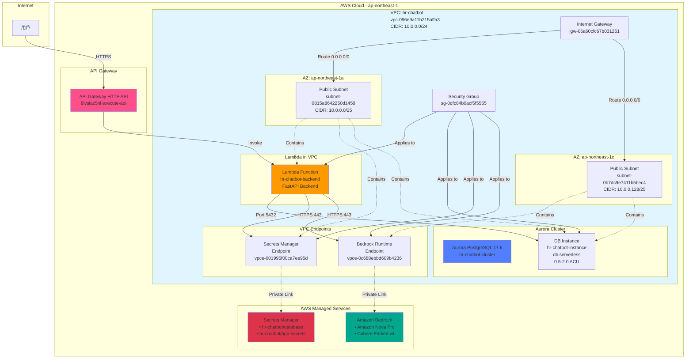

# Aurora PostgreSQL Serverless v2 部署指南

本文檔記錄 Aurora PostgreSQL Serverless v2 與相關 AWS 服務的部署過程，包含網路架構、遇到的問題及解決方案。

**部署日期**: 2025-12-02
**AWS Region**: ap-northeast-1 (Tokyo)
**部署工具**: aws-vault + aws-cli

---

## 系統架構圖

### 完整架構



### 網路架構詳細圖

```
┌─────────────────────────────────────────────────────────────────────────┐
│ VPC: hr-chatbot (vpc-096e9a11b215affa3)                                │
│ CIDR: 10.0.0.0/24                                                       │
│ DNS Support: Enabled                                                     │
│ DNS Hostnames: Enabled                                                   │
├─────────────────────────────────────────────────────────────────────────┤
│                                                                           │
│  ┌──────────────────────────────────────────────────────────────────┐  │
│  │ Internet Gateway: igw-06a60cfc67b031251                          │  │
│  └──────────────────────────────────────────────────────────────────┘  │
│                                  │                                       │
│                                  │ Route Table                           │
│                                  │ rtb-0a2c110b3e52d0983                │
│                                  │ Route: 0.0.0.0/0 → IGW               │
│                    ┌─────────────┴─────────────┐                        │
│                    │                           │                        │
│  ┌─────────────────▼──────────┐  ┌────────────▼──────────────┐        │
│  │ AZ: ap-northeast-1a        │  │ AZ: ap-northeast-1c       │        │
│  │                            │  │                           │        │
│  │ Public Subnet              │  │ Public Subnet             │        │
│  │ subnet-0815a8642250d1459   │  │ subnet-0b7dc9e7411b5bec4  │        │
│  │ CIDR: 10.0.0.0/25          │  │ CIDR: 10.0.0.128/25       │        │
│  │ IPs: 10.0.0.0 - 10.0.0.127 │  │ IPs: 10.0.0.128-10.0.0.255│        │
│  │ Available: 123 IPs         │  │ Available: 123 IPs        │        │
│  │                            │  │                           │        │
│  │ ┌────────────────────────┐ │  │ ┌───────────────────────┐│        │
│  │ │ Lambda ENI             │ │  │ │ VPC Endpoint ENI      ││        │
│  │ │ (Dynamic IP)           │ │  │ │ Bedrock Runtime       ││        │
│  │ └────────────────────────┘ │  │ └───────────────────────┘│        │
│  │                            │  │                           │        │
│  │ ┌────────────────────────┐ │  │ ┌───────────────────────┐│        │
│  │ │ VPC Endpoint ENI       │ │  │ │ Aurora Instance       ││        │
│  │ │ Secrets Manager        │ │  │ │ (Writer)              ││        │
│  │ └────────────────────────┘ │  │ └───────────────────────┘│        │
│  │                            │  │                           │        │
│  │ ┌────────────────────────┐ │  │                           │        │
│  │ │ Aurora Instance        │ │  │                           │        │
│  │ │ (Replica possible)     │ │  │                           │        │
│  │ └────────────────────────┘ │  │                           │        │
│  └────────────────────────────┘  └───────────────────────────┘        │
│                                                                         │
│  ┌──────────────────────────────────────────────────────────────────┐ │
│  │ Security Group: hr-chatbot-aurora-sg (sg-0dfc84b0acf5f5565)      │ │
│  ├──────────────────────────────────────────────────────────────────┤ │
│  │ Inbound Rules:                                                    │ │
│  │  • PostgreSQL (5432) ← Same SG (Lambda, Aurora)                 │ │
│  │  • PostgreSQL (5432) ← 61.222.146.136/32 (本地開發)              │ │
│  │  • HTTPS (443) ← Same SG (Lambda ↔ VPC Endpoints)               │ │
│  ├──────────────────────────────────────────────────────────────────┤ │
│  │ Outbound Rules:                                                   │ │
│  │  • All traffic (0.0.0.0/0)                                       │ │
│  └──────────────────────────────────────────────────────────────────┘ │
│                                                                         │
└─────────────────────────────────────────────────────────────────────────┘
```

### 資料流向圖

```
┌──────────┐
│  User    │
│ (Client) │
└────┬─────┘
     │ HTTPS Request
     │
     ▼
┌─────────────────────────┐
│   API Gateway           │
│ (Public Endpoint)       │
└────┬────────────────────┘
     │ Invoke Lambda
     │
     ▼
┌─────────────────────────────────────────────┐
│  Lambda Function (in VPC)                   │
│  • FastAPI Backend                          │
│  • ENV: DB_SECRET_NAME, APP_SECRET_NAME     │
└─┬──────────────┬──────────────┬─────────────┘
  │              │              │
  │ ① Read       │ ② Query      │ ③ AI Request
  │ Credentials  │ Database     │
  │              │              │
  ▼              ▼              ▼
┌──────────┐  ┌──────────────┐  ┌──────────────┐
│ Secrets  │  │   Aurora     │  │   Bedrock    │
│ Manager  │  │ PostgreSQL   │  │   Runtime    │
│          │  │ + pgvector   │  │ • Nova Pro   │
│ (via VPC │  │              │  │ • Cohere v4  │
│ Endpoint)│  │ Port: 5432   │  │              │
│          │  │              │  │ (via VPC     │
│          │  │              │  │  Endpoint)   │
└──────────┘  └──────────────┘  └──────────────┘
```

---

## 部署步驟記錄

### 步驟 1: 準備 VPC 和 Subnets

#### 1.1 創建 Subnets

原有 VPC `hr-chatbot` (vpc-096e9a11b215affa3) CIDR 為 10.0.0.0/24，需要創建跨 AZ 的 subnets。

```bash
# 刪除舊 subnet (有 VPC Endpoint 依賴)
aws ec2 delete-vpc-endpoints --vpc-endpoint-ids vpce-05ed4eb31bfcc439c
aws ec2 delete-network-interface --network-interface-id eni-05037aff5d5726989
aws ec2 delete-subnet --subnet-id subnet-0fd49a06a2cb949bb

# 創建 Subnet 1 (AZ: 1a)
aws ec2 create-subnet \
    --vpc-id vpc-096e9a11b215affa3 \
    --cidr-block 10.0.0.0/25 \
    --availability-zone ap-northeast-1a \
    --tag-specifications 'ResourceType=subnet,Tags=[{Key=Name,Value=hr-chatbot-1a}]'
# 輸出: subnet-0815a8642250d1459

# 創建 Subnet 2 (AZ: 1c)
aws ec2 create-subnet \
    --vpc-id vpc-096e9a11b215affa3 \
    --cidr-block 10.0.0.128/25 \
    --availability-zone ap-northeast-1c \
    --tag-specifications 'ResourceType=subnet,Tags=[{Key=Name,Value=hr-chatbot-1c}]'
# 輸出: subnet-0b7dc9e7411b5bec4
```

#### 1.2 配置 Internet Gateway

```bash
# 創建 IGW
aws ec2 create-internet-gateway
# 輸出: igw-06a60cfc67b031251

# 附加到 VPC
aws ec2 attach-internet-gateway \
    --internet-gateway-id igw-06a60cfc67b031251 \
    --vpc-id vpc-096e9a11b215affa3

# 添加路由
aws ec2 create-route \
    --route-table-id rtb-0a2c110b3e52d0983 \
    --destination-cidr-block 0.0.0.0/0 \
    --gateway-id igw-06a60cfc67b031251
```

#### 1.3 啟用 VPC DNS 支援

```bash
# 啟用 DNS support
aws ec2 modify-vpc-attribute \
    --vpc-id vpc-096e9a11b215affa3 \
    --enable-dns-support

# 啟用 DNS hostnames (Aurora publicly accessible 需要)
aws ec2 modify-vpc-attribute \
    --vpc-id vpc-096e9a11b215affa3 \
    --enable-dns-hostnames
```

#### 1.4 啟用 Subnet 自動分配公網 IP

```bash
aws ec2 modify-subnet-attribute \
    --subnet-id subnet-0815a8642250d1459 \
    --map-public-ip-on-launch

aws ec2 modify-subnet-attribute \
    --subnet-id subnet-0b7dc9e7411b5bec4 \
    --map-public-ip-on-launch
```

---

### 步驟 2: 創建 Security Group

```bash
# 創建 Security Group
aws ec2 create-security-group \
    --group-name hr-chatbot-aurora-sg \
    --description "Security group for HR Chatbot Aurora PostgreSQL" \
    --vpc-id vpc-096e9a11b215affa3
# 輸出: sg-0dfc84b0acf5f5565

# 規則 1: 允許 SG 內部 PostgreSQL 通信 (Lambda ↔ Aurora)
aws ec2 authorize-security-group-ingress \
    --group-id sg-0dfc84b0acf5f5565 \
    --protocol tcp \
    --port 5432 \
    --source-group sg-0dfc84b0acf5f5565

# 規則 2: 允許本地 IP 訪問 (開發測試用)
aws ec2 authorize-security-group-ingress \
    --group-id sg-0dfc84b0acf5f5565 \
    --protocol tcp \
    --port 5432 \
    --cidr 61.222.146.136/32

# 規則 3: 允許 HTTPS 訪問 VPC Endpoints
aws ec2 authorize-security-group-ingress \
    --group-id sg-0dfc84b0acf5f5565 \
    --protocol tcp \
    --port 443 \
    --source-group sg-0dfc84b0acf5f5565
```

---

### 步驟 3: 創建 RDS Resources

#### 3.1 創建 DB Subnet Group

```bash
aws rds create-db-subnet-group \
    --db-subnet-group-name hr-chatbot-subnet-group \
    --db-subnet-group-description "Subnet group for HR Chatbot Aurora" \
    --subnet-ids subnet-0815a8642250d1459 subnet-0b7dc9e7411b5bec4
```

#### 3.2 生成資料庫密碼

```bash
openssl rand -base64 32 | tr -d '/+=' | cut -c1-32
# 輸出: H0Afk0Psa8HR71VguHEt8QudB4l1WoWZ
```

#### 3.3 創建 Aurora Cluster

```bash
aws rds create-db-cluster \
    --db-cluster-identifier hr-chatbot-cluster \
    --engine aurora-postgresql \
    --engine-version 17.6 \
    --master-username postgres \
    --master-user-password H0Afk0Psa8HR71VguHEt8QudB4l1WoWZ \
    --database-name hr_chatbot \
    --db-subnet-group-name hr-chatbot-subnet-group \
    --vpc-security-group-ids sg-0dfc84b0acf5f5565 \
    --serverless-v2-scaling-configuration MinCapacity=0.5,MaxCapacity=2.0 \
    --engine-mode provisioned
```

**關鍵輸出**:

- Cluster Endpoint: `hr-chatbot-cluster.cluster-c98qk102ncqc.ap-northeast-1.rds.amazonaws.com`
- Status: creating → available

#### 3.4 創建 DB Instance

```bash
aws rds create-db-instance \
    --db-instance-identifier hr-chatbot-instance \
    --db-cluster-identifier hr-chatbot-cluster \
    --db-instance-class db.serverless \
    --engine aurora-postgresql
```

**關鍵輸出**:

- Instance Endpoint: `hr-chatbot-instance.c98qk102ncqc.ap-northeast-1.rds.amazonaws.com`

#### 3.5 設定 Publicly Accessible (本地開發)

```bash
aws rds modify-db-instance \
    --db-instance-identifier hr-chatbot-instance \
    --publicly-accessible \
    --apply-immediately
```

---

### 步驟 4: 設定 Secrets Manager

#### 4.1 創建資料庫憑證 Secret

```bash
aws secretsmanager create-secret \
    --name hr-chatbot/database \
    --description "Database credentials for HR Chatbot" \
    --secret-string '{
        "host":"hr-chatbot-cluster.cluster-c98qk102ncqc.ap-northeast-1.rds.amazonaws.com",
        "port":5432,
        "database":"hr_chatbot",
        "username":"postgres",
        "password":"H0Afk0Psa8HR71VguHEt8QudB4l1WoWZ"
    }'
```

#### 4.2 創建應用 Secret (JWT)

```bash
# 生成 JWT Secret Key
openssl rand -base64 64 | tr -d '\n'
# 輸出: DmA9/ARuoGid8D6VOurbYeVaSMaOeZKfZWpYHL/bJENMsLdxHC4lbLkijA4cywGcXDtBc+187QutzY0V7fZcHw==

aws secretsmanager create-secret \
    --name hr-chatbot/app-secrets \
    --description "Application secrets for HR Chatbot (JWT keys)" \
    --secret-string '{
        "secret_key":"DmA9/ARuoGid8D6VOurbYeVaSMaOeZKfZWpYHL/bJENMsLdxHC4lbLkijA4cywGcXDtBc+187QutzY0V7fZcHw==",
        "algorithm":"HS256"
    }'
```

---

### 步驟 5: 安裝 pgvector Extension

使用 TablePlus 或 psql 連接到 Aurora：

```sql
-- 連接資訊
Host: hr-chatbot-instance.c98qk102ncqc.ap-northeast-1.rds.amazonaws.com
Port: 5432
Database: hr_chatbot
Username: postgres
Password: H0Afk0Psa8HR71VguHEt8QudB4l1WoWZ

-- 安裝 pgvector
CREATE EXTENSION IF NOT EXISTS vector;

-- 驗證
\dx
SELECT '[1,2,3]'::vector;
```

---

### 步驟 6: 配置 Lambda 連接 Aurora

#### 6.1 更新 Lambda VPC 配置

```bash
aws lambda update-function-configuration \
    --function-name hr-chatbot-backend \
    --vpc-config SubnetIds=subnet-0815a8642250d1459,subnet-0b7dc9e7411b5bec4,SecurityGroupIds=sg-0dfc84b0acf5f5565
```

⚠️ **錯誤**: Lambda role 缺少 VPC 權限

**解決方案**: 在 IAM Console 為 `hr-chatbot-lambda-role` 附加:

- `AWSLambdaVPCAccessExecutionRole`

#### 6.2 更新 Lambda 環境變數

```bash
aws lambda update-function-configuration \
    --function-name hr-chatbot-backend \
    --environment 'Variables={
        DB_SECRET_NAME=hr-chatbot/database,
        APP_SECRET_NAME=hr-chatbot/app-secrets,
        ENABLE_RAG=true,
        LLM_MODEL_ID=amazon.nova-pro-v1:0,
        EMBEDDING_MODEL_ID=cohere.embed-v4:0
    }'
```

⚠️ **注意**: 不要設定 `AWS_REGION`，這是 Lambda 保留變數。

---

### 步驟 7: 創建 VPC Endpoints

Lambda 在 VPC 中無法訪問公網 AWS 服務，需要 VPC Endpoints。

#### 7.1 Secrets Manager Endpoint

```bash
aws ec2 create-vpc-endpoint \
    --vpc-id vpc-096e9a11b215affa3 \
    --service-name com.amazonaws.ap-northeast-1.secretsmanager \
    --vpc-endpoint-type Interface \
    --subnet-ids subnet-0815a8642250d1459 subnet-0b7dc9e7411b5bec4 \
    --security-group-ids sg-0dfc84b0acf5f5565
# 輸出: vpce-001995f00ca7ee95d
```

#### 7.2 Bedrock Runtime Endpoint

```bash
aws ec2 create-vpc-endpoint \
    --vpc-id vpc-096e9a11b215affa3 \
    --service-name com.amazonaws.ap-northeast-1.bedrock-runtime \
    --vpc-endpoint-type Interface \
    --subnet-ids subnet-0815a8642250d1459 subnet-0b7dc9e7411b5bec4 \
    --security-group-ids sg-0dfc84b0acf5f5565
# 輸出: vpce-0c688ebbd609b4236
```

---

## 遇到的問題與解決方案

### 問題 1: Subnet CIDR 衝突

**錯誤訊息**:

```
InvalidSubnet.Conflict: The CIDR '10.0.0.128/25' conflicts with another subnet
```

**原因**: VPC CIDR 10.0.0.0/24 原本只有 1 個 subnet 佔用了全部空間。

**解決方案**:

1. 刪除舊 subnet
2. 重新創建兩個 /25 subnets:
   - 10.0.0.0/25 (IPs: 10.0.0.0-127)
   - 10.0.0.128/25 (IPs: 10.0.0.128-255)

---

### 問題 2: Aurora 無法設為 Publicly Accessible

**錯誤訊息**:

```
InvalidVPCNetworkStateFault: Cannot create a publicly accessible DBInstance.
The specified VPC has no internet gateway attached.
```

**原因**: VPC 缺少 Internet Gateway。

**解決方案**:

```bash
# 創建並附加 IGW
aws ec2 create-internet-gateway
aws ec2 attach-internet-gateway --internet-gateway-id igw-xxx --vpc-id vpc-xxx

# 添加路由
aws ec2 create-route --route-table-id rtb-xxx \
    --destination-cidr-block 0.0.0.0/0 --gateway-id igw-xxx
```

---

### 問題 3: Aurora 設為 Public 時 DNS 錯誤

**錯誤訊息**:

```
InvalidVPCNetworkStateFault: The specified VPC does not support DNS resolution,
DNS hostnames, or both.
```

**原因**: VPC 未啟用 DNS support 和 DNS hostnames。

**解決方案**:

```bash
aws ec2 modify-vpc-attribute --vpc-id vpc-xxx --enable-dns-support
aws ec2 modify-vpc-attribute --vpc-id vpc-xxx --enable-dns-hostnames
```

---

### 問題 4: Lambda Init Timeout

**錯誤訊息**:

```
INIT_REPORT Init Duration: 10000.09 ms Phase: init Status: timeout
```

**原因**: Lambda 在 VPC 中初始化時嘗試訪問 Secrets Manager 和 Bedrock，但沒有網路路徑。

**解決方案**: 創建 VPC Endpoints (步驟 7)。

---

### 問題 5: Lambda 無法訪問 VPC Endpoints

**錯誤訊息**: 仍然 timeout

**原因**: Security Group 沒有允許 HTTPS (443) 流量到 VPC Endpoints。

**解決方案**:

```bash
aws ec2 authorize-security-group-ingress \
    --group-id sg-0dfc84b0acf5f5565 \
    --protocol tcp \
    --port 443 \
    --source-group sg-0dfc84b0acf5f5565
```

---

### 問題 6: Lambda 無權訪問 Secrets Manager

**錯誤訊息**:

```
AccessDeniedException: User: arn:aws:sts::xxx:assumed-role/hr-chatbot-lambda-role/hr-chatbot-backend
is not authorized to perform: secretsmanager:GetSecretValue
```

**原因**: Lambda IAM Role 缺少 Secrets Manager 權限。

**解決方案**: 在 IAM Console 為 `hr-chatbot-lambda-role` 附加:

- `SecretsManagerReadWrite` 或自定義最小權限 policy

---

### 問題 7: Lambda 無法解析 DATABASE_URL

**錯誤訊息**:

```
ArgumentError: Could not parse SQLAlchemy URL from given URL string
```

**原因**: 無法從 Secrets Manager 讀取憑證，DATABASE_URL 為空。

**解決方案**: 解決問題 6 後自動修復。

---

## 最終配置摘要

### VPC 配置

| 資源             | ID                       | 值                   |
| ---------------- | ------------------------ | -------------------- |
| VPC              | vpc-096e9a11b215affa3    | hr-chatbot           |
| CIDR             | -                        | 10.0.0.0/24          |
| Subnet 1 (1a)    | subnet-0815a8642250d1459 | 10.0.0.0/25          |
| Subnet 2 (1c)    | subnet-0b7dc9e7411b5bec4 | 10.0.0.128/25        |
| Internet Gateway | igw-06a60cfc67b031251    | -                    |
| Route Table      | rtb-0a2c110b3e52d0983    | 0.0.0.0/0 → IGW      |
| Security Group   | sg-0dfc84b0acf5f5565     | hr-chatbot-aurora-sg |

### Aurora 配置

| 屬性              | 值                                                                       |
| ----------------- | ------------------------------------------------------------------------ |
| Cluster ID        | hr-chatbot-cluster                                                       |
| Instance ID       | hr-chatbot-instance                                                      |
| Engine            | aurora-postgresql                                                        |
| Version           | 17.6                                                                     |
| Instance Class    | db.serverless                                                            |
| Scaling           | 0.5 - 2.0 ACU                                                            |
| Database          | hr_chatbot                                                               |
| Username          | postgres                                                                 |
| Password          | H0Afk0Psa8HR71VguHEt8QudB4l1WoWZ                                         |
| Cluster Endpoint  | hr-chatbot-cluster.cluster-c98qk102ncqc.ap-northeast-1.rds.amazonaws.com |
| Instance Endpoint | hr-chatbot-instance.c98qk102ncqc.ap-northeast-1.rds.amazonaws.com        |
| Extensions        | pgvector ✅                                                              |

### Secrets Manager

| Secret Name            | 內容                                         |
| ---------------------- | -------------------------------------------- |
| hr-chatbot/database    | `{host, port, database, username, password}` |
| hr-chatbot/app-secrets | `{secret_key, algorithm}`                    |

### Lambda 配置

| 屬性           | 值                                                 |
| -------------- | -------------------------------------------------- |
| Function Name  | hr-chatbot-backend                                 |
| VPC            | vpc-096e9a11b215affa3                              |
| Subnets        | subnet-0815a8642250d1459, subnet-0b7dc9e7411b5bec4 |
| Security Group | sg-0dfc84b0acf5f5565                               |
| Timeout        | 60 seconds                                         |
| Memory         | 1024 MB                                            |
| Role           | hr-chatbot-lambda-role                             |

**環境變數**:

```
DB_SECRET_NAME=hr-chatbot/database
APP_SECRET_NAME=hr-chatbot/app-secrets
ENABLE_RAG=true
LLM_MODEL_ID=amazon.nova-pro-v1:0
EMBEDDING_MODEL_ID=cohere.embed-v4:0
```

**IAM Policies**:

- AWSLambdaBasicExecutionRole
- AWSLambdaVPCAccessExecutionRole
- SecretsManagerReadWrite
- AmazonBedrockFullAccess

### VPC Endpoints

| Service         | Endpoint ID            | Private DNS |
| --------------- | ---------------------- | ----------- |
| Secrets Manager | vpce-001995f00ca7ee95d | Enabled     |
| Bedrock Runtime | vpce-0c688ebbd609b4236 | Enabled     |

---

## 驗證部署

### 1. 測試 API Gateway → Lambda

```bash
curl https://8lvsiaz5nl.execute-api.ap-northeast-1.amazonaws.com/health
```

**期望輸出**:

```json
{ "status": "healthy" }
```

### 2. 測試本地連接 Aurora

```bash
psql -h hr-chatbot-instance.c98qk102ncqc.ap-northeast-1.rds.amazonaws.com \
     -U postgres -d hr_chatbot -c "SELECT version();"
```

### 3. 驗證 pgvector

```bash
psql -h hr-chatbot-instance.c98qk102ncqc.ap-northeast-1.rds.amazonaws.com \
     -U postgres -d hr_chatbot -c "\dx"
```

應該看到 `vector` extension。

### 4. 測試 Lambda → Aurora 連接

查看 Lambda logs:

```bash
aws logs tail /aws/lambda/hr-chatbot-backend --follow
```

應該沒有資料庫連接錯誤。

---

## 成本估算

### Aurora Serverless v2

- **最小容量**: 0.5 ACU
- **最大容量**: 2.0 ACU
- **價格**: ~$0.12 per ACU-hour (ap-northeast-1)
- **估算月成本** (假設平均 0.5 ACU):
  - 0.5 ACU × 730 hours × $0.12 = **~$44/month**

### VPC Endpoints

- **每個 Endpoint**: $0.01/hour
- **2 個 Endpoints**: $0.02/hour
- **估算月成本**:
  - $0.02 × 730 hours = **~$15/month**

### Lambda

- **Memory**: 1024 MB
- **假設請求**: 100,000 requests/month
- **平均執行時間**: 2 seconds
- **估算月成本**: **~$5/month**

### 總計

約 **$64/month** (不含資料傳輸費用)

---

## 注意事項

### Security

1. **Production 環境建議**:
   - Aurora 改為 Private only (移除 publicly accessible)
   - 移除本地 IP 的 Security Group 規則
   - 使用 Secrets Manager rotation
   - 啟用 Aurora encryption at rest

2. **IAM 最小權限**:
   - Lambda role 改用自定義 policy，不使用 `*FullAccess`
   - 限制 Secrets Manager 訪問特定 secret ARN

### Performance

1. **冷啟動優化**:
   - 考慮 Lambda Provisioned Concurrency
   - 優化 Docker image 大小
   - 使用 Aurora Data API (無需 VPC)

2. **Aurora Scaling**:
   - 監控 ACU 使用率
   - 根據實際需求調整 min/max capacity

### Monitoring

建議啟用:

- CloudWatch Logs (Lambda, RDS)
- CloudWatch Metrics (Lambda duration, RDS connections)
- RDS Performance Insights
- VPC Flow Logs (troubleshooting)

---

## 參考資料

- [Aurora Serverless v2 Documentation](https://docs.aws.amazon.com/AmazonRDS/latest/AuroraUserGuide/aurora-serverless-v2.html)
- [Lambda VPC Configuration](https://docs.aws.amazon.com/lambda/latest/dg/configuration-vpc.html)
- [VPC Endpoints for AWS Services](https://docs.aws.amazon.com/vpc/latest/privatelink/aws-services-privatelink-support.html)
- [pgvector Extension](https://github.com/pgvector/pgvector)

---

**最後更新**: 2025-12-02
**維護者**: Ting Zhang
