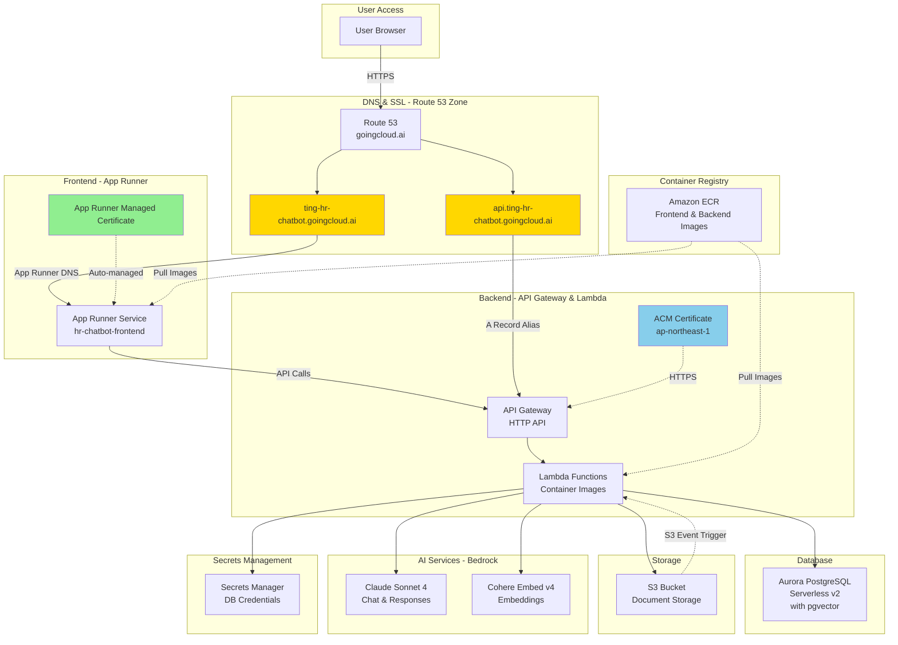
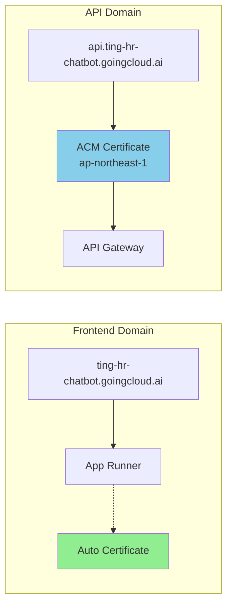
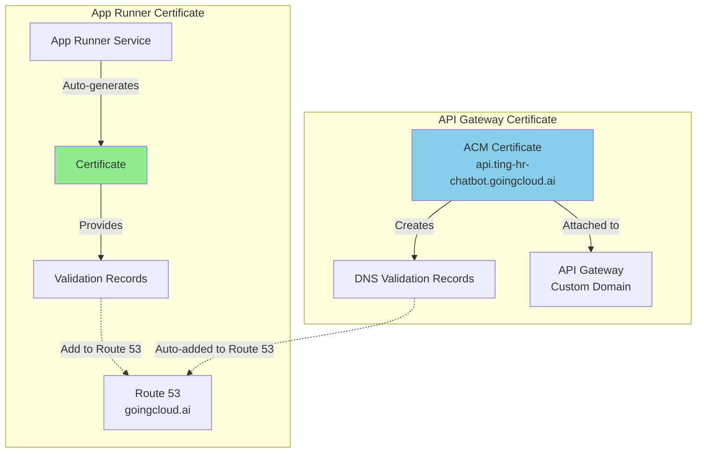

```mermaid
graph TB
    subgraph "User Access"
        User[User Browser]
    end

    subgraph "DNS & SSL - Route 53 Zone"
        R53[Route 53<br/>goingcloud.ai]
        FrontendDomain[ting-hr-chatbot.goingcloud.ai]
        APIDomain[api.ting-hr-chatbot.goingcloud.ai]
    end

    subgraph "Frontend - App Runner"
        AppRunner[App Runner Service<br/>hr-chatbot-frontend]
        AppRunnerCert[App Runner Managed Certificate]
    end

    subgraph "Backend - API Gateway & Lambda"
        APIGW[API Gateway<br/>HTTP API]
        APICert[ACM Certificate<br/>ap-northeast-1]
        Lambda[Lambda Functions<br/>Container Images]
    end

    subgraph "Container Registry"
        ECR[Amazon ECR<br/>Frontend & Backend Images]
    end

    subgraph "Database"
        Aurora[Aurora PostgreSQL<br/>Serverless v2<br/>with pgvector]
    end

    subgraph "Storage"
        S3[S3 Bucket<br/>Document Storage]
    end

    subgraph "AI Services - Bedrock"
        Claude[Claude Sonnet 4<br/>Chat & Responses]
        Cohere[Cohere Embed v4<br/>Embeddings]
    end

    subgraph "Secrets Management"
        SecretsManager[Secrets Manager<br/>DB Credentials]
    end

    User -->|HTTPS| R53
    R53 --> FrontendDomain
    R53 --> APIDomain

    FrontendDomain -->|App Runner DNS| AppRunner
    AppRunnerCert -.->|Auto-managed| AppRunner
    AppRunner -->|API Calls| APIGW

    APIDomain -->|A Record Alias| APIGW
    APICert -.->|HTTPS| APIGW
    APIGW --> Lambda

    ECR -.->|Pull Images| AppRunner
    ECR -.->|Pull Images| Lambda

    Lambda --> Aurora
    Lambda --> S3
    Lambda --> Claude
    Lambda --> Cohere
    Lambda --> SecretsManager

    S3 -.->|S3 Event Trigger| Lambda

    style AppRunnerCert fill:#90EE90
    style APICert fill:#87CEEB
    style FrontendDomain fill:#FFD700
    style APIDomain fill:#FFD700
```

## Certificate Management

---

```mermaid
graph LR
    subgraph "Frontend Domain"
        FD[ting-hr-chatbot.goingcloud.ai]
        FD --> AR[App Runner]
        AR -.-> ARC[Auto Certificate]
    end

    subgraph "API Domain"
        AD[api.ting-hr-chatbot.goingcloud.ai]
        AD --> ACM2[ACM Certificate<br/>ap-northeast-1]
        ACM2 --> AGW[API Gateway]
    end

    style ARC fill:#90EE90
    style ACM2 fill:#87CEEB
```

```mermaid
graph TB
    subgraph "App Runner Certificate"
        AR2[App Runner Service]
        ARC2[Certificate]
        ARV[Validation Records]

        AR2 -->|Auto-generates| ARC2
        ARC2 -->|Provides| ARV
        ARV -.->|Add to Route 53| R532
    end

    subgraph "API Gateway Certificate"
        ACM3[ACM Certificate<br/>api.ting-hr-chatbot.goingcloud.ai]
        ACMV[DNS Validation Records]
        AGW2[API Gateway<br/>Custom Domain]

        ACM3 -->|Creates| ACMV
        ACMV -.->|Auto-added to Route 53| R532
        ACM3 -->|Attached to| AGW2
    end

    R532[Route 53<br/>goingcloud.ai]

    style ARC2 fill:#90EE90
    style ACM3 fill:#87CEEB
```
