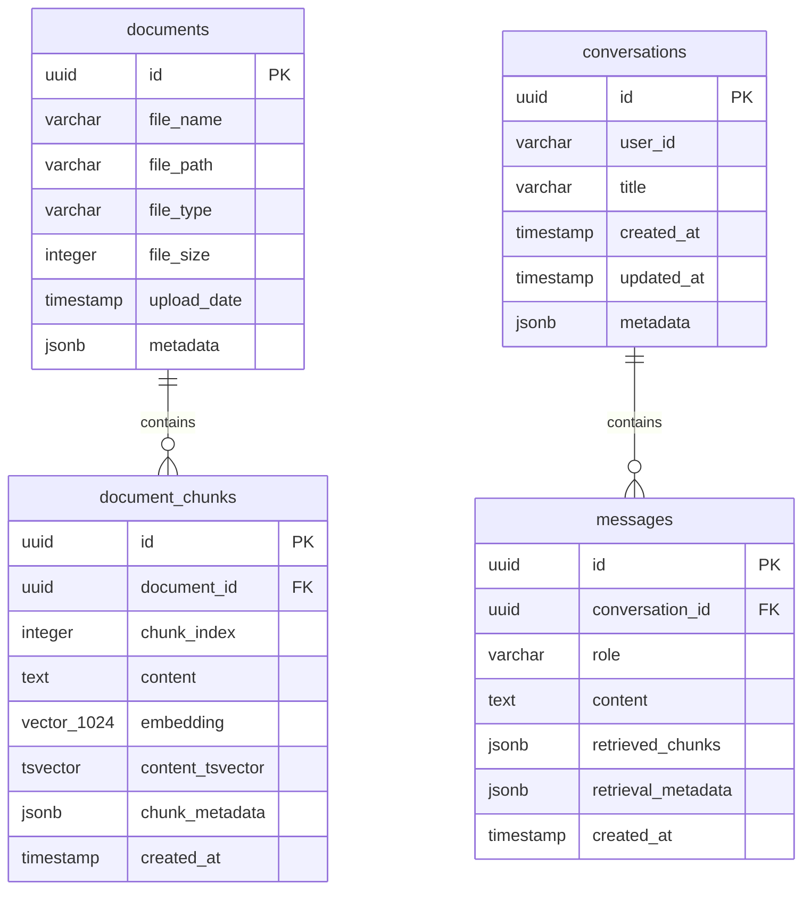

# Database Entity-Relationship Diagram

## Schema Overview

The HR Chatbot database consists of 4 main tables designed for RAG (Retrieval-Augmented Generation) and multi-turn conversations.

## Entity-Relationship Diagram



## Table Relationships

### documents ↔ document_chunks (One-to-Many)

- Each document can have multiple chunks
- Chunks are ordered by `chunk_index`
- Cascade delete: Deleting a document deletes all its chunks

### conversations ↔ messages (One-to-Many)

- Each conversation can have multiple messages
- Messages are ordered by `created_at`
- Cascade delete: Deleting a conversation deletes all its messages

## Key Features

### Hybrid Search Support

**document_chunks** table supports two types of searches:

1. **Semantic Search** (Vector Similarity)
   - Column: `embedding` (VECTOR type with 1024 dimensions)
   - Index: IVFFlat index with cosine distance
   - Model: Cohere Embed v4 via Amazon Bedrock

2. **BM25 Search** (Full-Text Search)
   - Column: `content_tsvector` (TSVECTOR type)
   - Index: GIN index
   - Method: PostgreSQL full-text search with ranking

### Conversation Context Tracking

**messages** table stores:
- `retrieved_chunks`: Which document chunks were used for the response
- `retrieval_metadata`: Scores and metadata from the retrieval process
- Enables analysis of retrieval quality and debugging

## Indexes

### document_chunks Indexes

```sql
-- Vector similarity search (IVFFlat)
CREATE INDEX idx_embedding_vector
ON document_chunks
USING ivfflat (embedding vector_cosine_ops)
WITH (lists = 100);

-- Full-text search (GIN)
CREATE INDEX idx_content_tsvector
ON document_chunks
USING gin (content_tsvector);

-- Document lookup
CREATE INDEX idx_document_chunk
ON document_chunks (document_id, chunk_index);
```

### conversations Indexes

```sql
-- User lookup
CREATE INDEX idx_conversation_user_id
ON conversations (user_id);

-- Time-based queries
CREATE INDEX idx_conversation_created_at
ON conversations (created_at);
```

### messages Indexes

```sql
-- Conversation lookup
CREATE INDEX idx_message_conversation_id
ON messages (conversation_id);

-- Time-based queries
CREATE INDEX idx_message_created_at
ON messages (created_at);

-- Role filtering
CREATE INDEX idx_message_role
ON messages (role);
```

## Data Types

### Special PostgreSQL Types

- **UUID**: Unique identifiers for all primary keys
- **JSONB**: Flexible metadata storage (efficient querying and indexing)
- **VECTOR**: pgvector extension type for embedding storage
- **TSVECTOR**: Full-text search document type
- **TIMESTAMP**: Timezone-aware timestamps

## Example Queries

### Insert Document with Chunks

```python
# Create document
doc = Document(
    file_name="handbook.pdf",
    file_path="s3://bucket/documents/handbook.pdf",
    file_type="pdf",
    file_size=1024000,
)
db.add(doc)
db.flush()

# Create chunk
chunk = DocumentChunk(
    document_id=doc.id,
    chunk_index=0,
    content="Employee benefits include health insurance...",
    embedding=[0.1, 0.2, ...],  # 1024-dim vector from Cohere
    chunk_metadata={"page": 1, "section": "Benefits"},
)
db.add(chunk)
db.commit()
```

### Hybrid Search Query

```python
from sqlalchemy import func

# Semantic search (top 5)
semantic = db.query(DocumentChunk).order_by(
    DocumentChunk.embedding.cosine_distance(query_vector)
).limit(5).all()

# BM25 search (top 5)
bm25 = db.query(DocumentChunk).filter(
    DocumentChunk.content_tsvector.match(query_text)
).order_by(
    func.ts_rank(DocumentChunk.content_tsvector, func.to_tsquery(query_text)).desc()
).limit(5).all()

# Combine results
results = list(set(semantic + bm25))
```

### Create Conversation with Messages

```python
# Create conversation
conv = Conversation(user_id="user123", title="HR Policy Questions")
db.add(conv)
db.flush()

# Add user message
user_msg = Message(
    conversation_id=conv.id,
    role="user",
    content="What are the vacation policies?",
)
db.add(user_msg)

# Add assistant message with retrieved chunks
assistant_msg = Message(
    conversation_id=conv.id,
    role="assistant",
    content="Our vacation policy allows...",
    retrieved_chunks=[str(chunk1.id), str(chunk2.id)],
    retrieval_metadata={"semantic_scores": [0.92, 0.87], "bm25_scores": [0.78, 0.85]},
)
db.add(assistant_msg)
db.commit()
```

## Scalability Considerations

### Current Design (Up to 1M vectors)

- IVFFlat index suitable for up to 1M vectors
- Efficient for small to medium datasets

### Future Optimizations (>1M vectors)

```sql
-- Switch to HNSW index for larger datasets
CREATE INDEX idx_embedding_hnsw
ON document_chunks
USING hnsw (embedding vector_cosine_ops);

-- Consider table partitioning for document_chunks
CREATE TABLE document_chunks_2025_01 PARTITION OF document_chunks
FOR VALUES FROM ('2025-01-01') TO ('2025-02-01');
```

## Storage Estimates

Assuming:
- Average chunk size: 1000 characters (1 KB)
- Vector size: 1024 dimensions × 4 bytes = 4 KB
- Metadata: ~1 KB

**Per chunk**: ~6 KB

**1000 documents × 100 chunks each**:
- Total chunks: 100,000
- Storage: ~600 MB (plus indexes)

## Maintenance

### Update Statistics

```sql
-- After bulk inserts
ANALYZE document_chunks;
ANALYZE messages;
```

### Reindex Vectors

```sql
-- If data distribution changes significantly
REINDEX INDEX idx_embedding_vector;
```

### Monitor Performance

```sql
-- Check index usage
SELECT
    schemaname,
    tablename,
    indexname,
    idx_scan,
    idx_tup_read
FROM pg_stat_user_indexes
WHERE schemaname = 'public'
ORDER BY idx_scan DESC;

-- Check table sizes
SELECT
    tablename,
    pg_size_pretty(pg_total_relation_size(schemaname||'.'||tablename)) AS size
FROM pg_tables
WHERE schemaname = 'public';
```

## Related Documentation

- [Database Schema Details](./database_schema.md)
- [Database Setup Guide](./setup_database.md)
- [Architecture Overview](../architecture.md)
